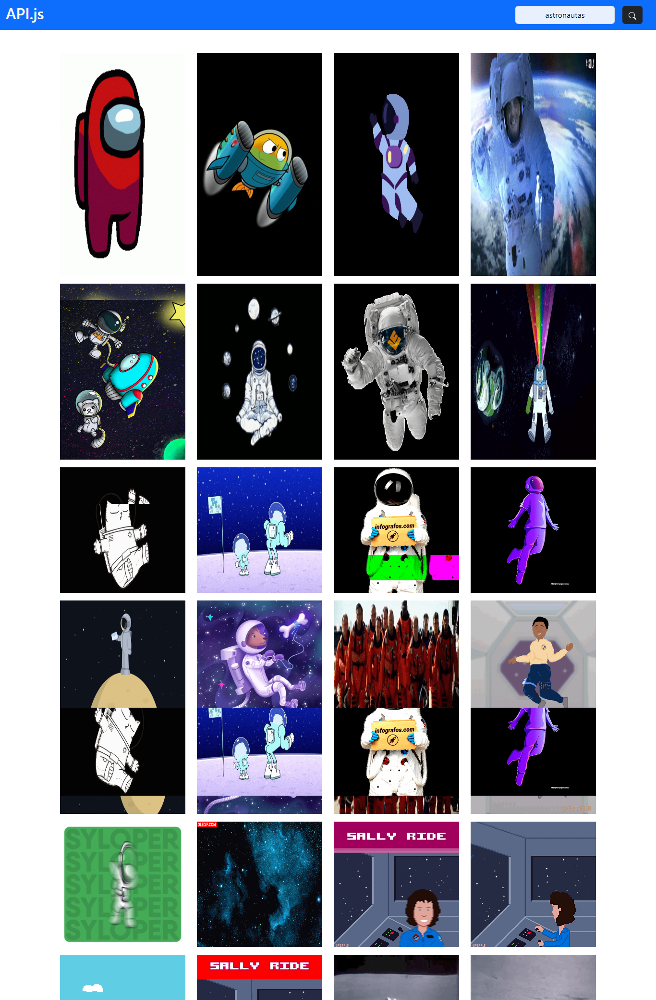

#   Consumo de API GIPHY con JavaScript

##  [API GIPHY](https://developers.giphy.com/docs/api/endpoint#search)

##  [DEMO](https://api-gifts-js.netlify.app/)

    

#   [Versión con Python](https://github.com/mssj-11/AppWeb_Flask_API-GIPHY)